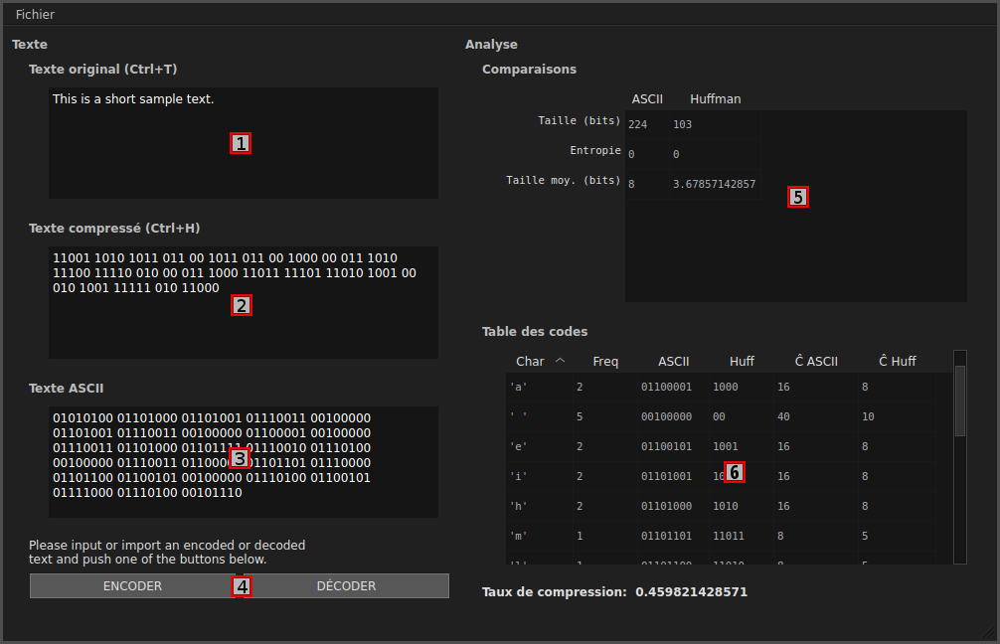

Graphic interface
=================

Interface presentation
----------------------

Voici la fenêtre que vous voyez lorsque vous lancez le programme avec son frontend graphique :

   The graphic interface window.

1. Zone du texte original. Il est possible de saisir ici un texte à encoder. Il est également possible d'importer le texte via le menu Fichier. A la fin d'un décodage le texte décodé s'affiche ici.

2. Zone du texte compressé. A la fin de l'encodage le texte compressé s'affiche ici. Il s'agit d'une suite de codes de Huffman, séparés par des espaces ; bien qu'ils ne soient pas nécessaires. Vous pouvez saisir un texte compressé ou l'importer depuis le menu Fichier dans cette zone pour de décompresser.

3. Zone du texte encodé en ASCII. Cet encadré affiche le texte original encodé en ASCII. Cela est surtout utile pour la comparaison des deux encodages.

4. Le bouton ENCODER permet d'encoder le texte original de la zone 1. et le bouton DECODER permet de décoder le texte compressé de la zone 2.. L'encodage et le décodage fait apparaitre un assistant pour vous guider au fil des étapes. Cet assistant est volontairement intégré à la fenêtr afin de suivre l'évolution des variables.

5. Cette table affiche trois variables permettant de comparer les deux encodages ASCII et Huffman. La Taille est celle du texte encodé ; l'Entropie de l'encodage ; la Taille moyenne d'un code.

6. La table des codes liste les caractères du dictionnaire utilisés pour compresser / décompresser du texte. À chacun d'eux elle fait correspondre son nombre d'occurences (Freq), son code ASCII (ASCII), son code de Huffman (Huff) et sont coût mémoire total en ASCII (Ĉ ASCII) et en code de Huffman (Ĉ Huff).
